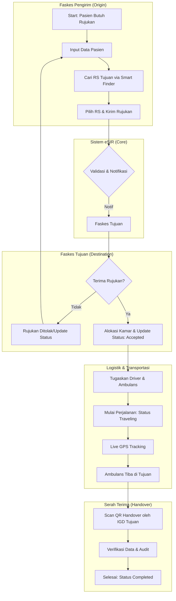
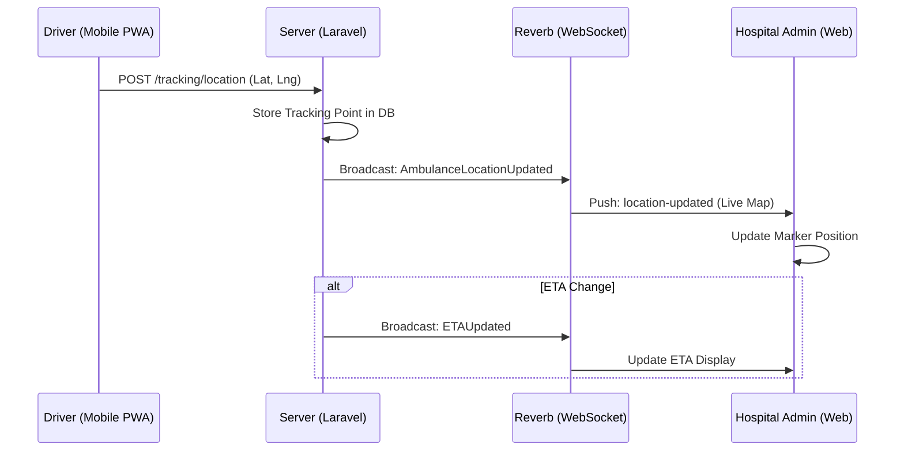
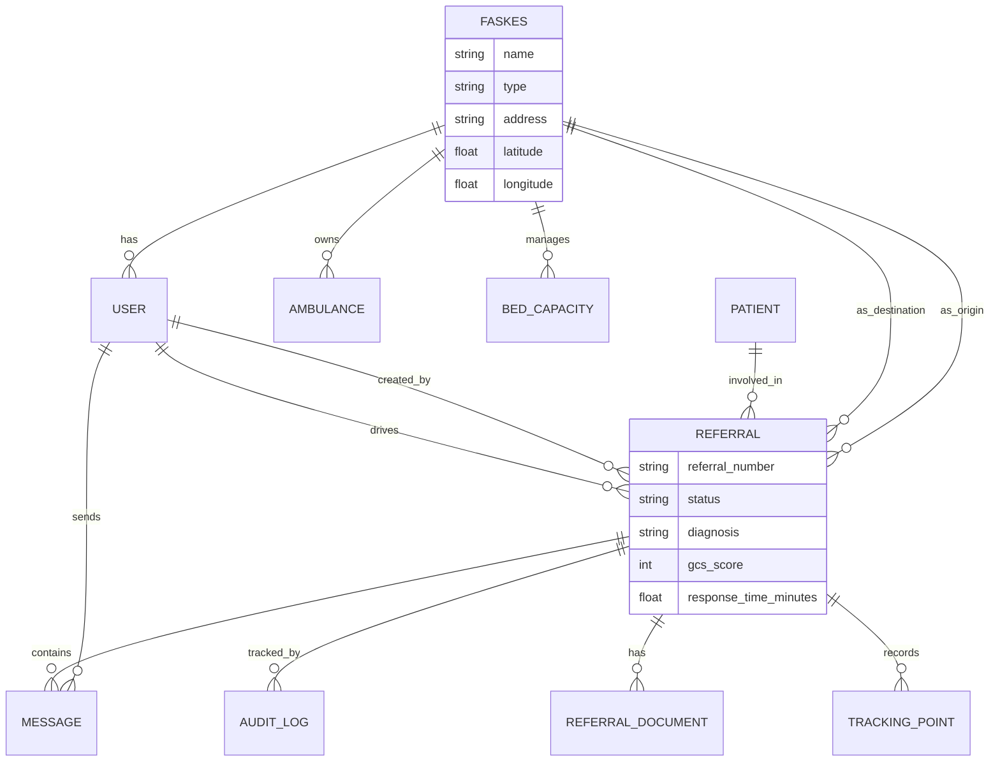

# Visual Documentation & Data Modeling: eSIR 2.1

This document provides the technical and process diagrams for the eSIR 2.1 system, essential for an IT Business Analyst's technical portfolio.

---

## 1. Flowchart: Patient Referral Process (BPMN 2.0 Style)

This diagram shows the end-to-end process from referral creation to patient handover.



---

## 2. UML Diagrams

### 2.1 Use Case Diagram
Describes the interactions between users and the system.

```mermaid
useCaseDiagram
    actor "Admin Pusat" as AP
    actor "Admin Faskes" as AF
    actor "Sopir Ambulans" as SA
    actor "Sistem Reverb" as SR

    AP --> (Manage Faskes & Users)
    AP --> (View Global Analytics)
    
    AF --> (Create/Edit Referral)
    AF --> (Monitor Incoming Referrals)
    AF --> (Manage Bed Capacity)
    AF --> (Scan QR Handover)
    
    SA --> (Update Location)
    SA --> (Start/End Mission)
    SA --> (View Navigation)
    
    SR --> (Broadcast Live GPS)
    (Broadcast Live GPS) <.. (Update Location) : <<include>>
```

### 2.2 Sequence Diagram: Real-time Tracking
Describes the message flow during an active referral journey.



---

## 3. Data Mapping & ERD

### 3.1 Entity Relationship Diagram (ERD)



### 3.2 Data Dictionary (Sample)

| Table | Column | Type | Description |
|:---|:---|:---|:---|
| **referrals** | status | ENUM | draft, sent, accepted, rejected, traveling, arrived, completed |
| **faskes** | latitude | DECIMAL | GPS Latitude coordinate for distance calculation |
| **patients** | nik | VARCHAR(16) | National Identity Number (Unique Identifier) |
| **tracking_points** | coordinates | POINT | Geospatial point for route history |
